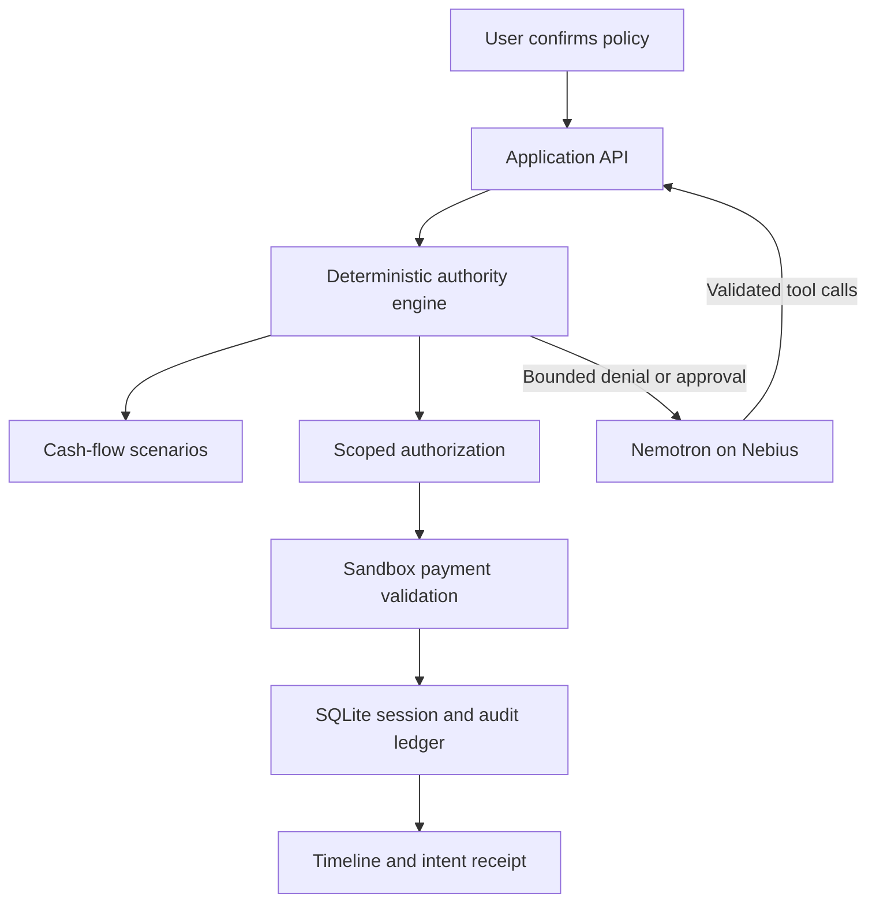

# Architecture and trust boundaries

## Responsibility map

| Responsibility | Owner | Reason |
| --- | --- | --- |
| Interpret policy language | Nemotron | Flexible language understanding; output remains an untrusted draft |
| Validate policy structure | Zod / backend | Reject malformed or unsupported authority |
| Confirm draft | User action with draft ID | Explicit ratification; stale draft IDs fail |
| Plan and replan travel | Nemotron tools | Actual model-driven option choice after engine denial |
| Calculate finances | Integer-cent engine | Reproducible exact arithmetic |
| Forecast uncertainty | Deterministic scenario rules | Inspectable treatment of expenses and uncertain/delayed income |
| Authorize | Engine | Cap, category, agent, policy, debt, velocity, exposure and liquidity checks |
| Issue credential | Backend | Opaque, short-lived and exact-intent bound |
| Execute payment | Sandbox adapter | Rechecks hash, expiry, usage, revocation, agent and deteriorated state |
| Commit state | D1 compare-and-swap | Atomic whole-session revision; stale concurrent commands are rejected |
| Present explanations | UI and agent summary | Uses authoritative decisions without revealing hidden model reasoning |

## Data path

The client has no API key and no reusable payment credential. POST `/api/covenant` accepts a discriminated command schema. A random HttpOnly/SameSite session cookie isolates sandbox state; optional Cloudflare Access controls who can reach the hosted app. An origin check rejects cross-origin writes. All balances, decisions, pending reservations, receipts, audit entries, and conversation tool history persist together in a D1 session row.

A command loads revision N, operates on its state copy, and conditionally saves only if revision is still N. Concurrent commands cannot both reserve or consume the same authority. Their effects are sandbox-state changes; there is no external payment side effect before the commit. A 409 requires read-back. A production payment rail would require an outbox/idempotency design to coordinate external effects with the ledger.

Model calls receive only confirmed policy scope, fixture travel inventory, bound approval references, and disclosure-limited denials. They do not receive account balances, rent, future income, credential secrets, or the full owner decision inspector. Reasoning content is not stored in the audit; only selected tool names, validated results, model name and token usage are recorded.

## Forecast algorithm

For each designated funding account, subtract active, unexpired reservations and the proposed spend at time zero. Expand scheduled and recurring events within the horizon. Apply outflows before inflows on the same day so intraday liquidity is checked conservatively. Include pending and uncertain expenses at full value. Check the minimum at every event and at time zero.

- Expected: income is weighted by basis-point confidence and rounded down to cents.
- Conservative: exclude any income with less than 100% confidence.
- Delayed income: postpone inflows by seven days, keeping full face amounts when received.

Both conservative and delayed-income minima must meet the reserve. No credit balance is treated as cash. Extra accounts do not silently rescue the designated funding account. Expense and income events are fictional and relative to the demo clock, not a bank feed.

Safe authority is the minimum of remaining aggregate policy budget and scenario minimum above the liquidity floor. Previously executed purchases already reduce account cash, so they are not subtracted twice. Outstanding reservations reduce both relevant cash and the aggregate cap. A bounded disclosure rounds the safe ceiling down to $50 increments and reports the preceding $50 band; it never rounds upward into unsafe permission.

## Purchase binding and receipts

Canonical sorted-key JSON of the typed purchase intent is SHA-256 hashed. The hash includes agent, policy, funding account, intent ID, merchant, amount, USD currency, purpose, debt flag, and every cart item. Credential references identify a stored exact intent, expiration, status and decision snapshot. The simulator recomputes the hash on execution. An atomic state commit marks the credential used and debits cash together.

Every audit record hashes its canonical body with the previous record hash. A receipt references its execution audit anchor and preserves the confirmed policy, forecast snapshot and exact intent. UI verification recomputes the chain. No blockchain or independent attestation is implied.

## Intentional implementation choices

The preferred separate Python/FastAPI stack was replaced with a Worker-compatible TypeScript backend for one deployable app. There is one authoritative engine, not duplicated finance implementations. D1 supplies SQLite persistence. The production build exports a Worker `fetch` handler. AP2 and actual payment rails remain adapter opportunities; the current execution path is entirely simulated.

## Execution-time state change and replanning

An operator-controlled demonstration checkpoint can pause after authority is issued. It does not alter the confirmed policy and does not choose the next itinerary. A new expense modifies the persisted financial event stream. Execution computes a fresh forecast while counting reservations once. If the reserve is breached, it revokes the stale authorization, releases the reservation, audits invalidation and returns a new bounded denial to the model. The next purchase still needs fresh authorization and remains subject to velocity and aggregate caps. Receipt forecasts are captured at execution so new obligations cannot leave a stale forward-impact claim.

The evaluation harness runs isolated seeded copies; it never executes into the live user session. Expected outcomes are hand-authored, and the baseline is explicitly limited to single-purchase cap/current-cash checks. Model request timing uses observed completion round-trip latency and excludes user pauses, browser time, payment simulation, and tool computation. No price/cost estimate is invented.
